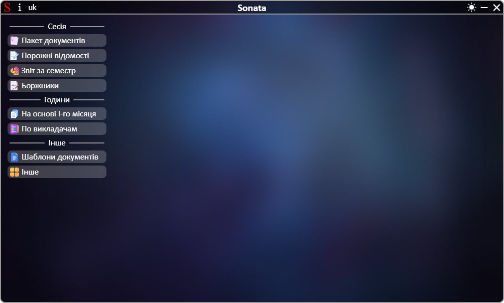
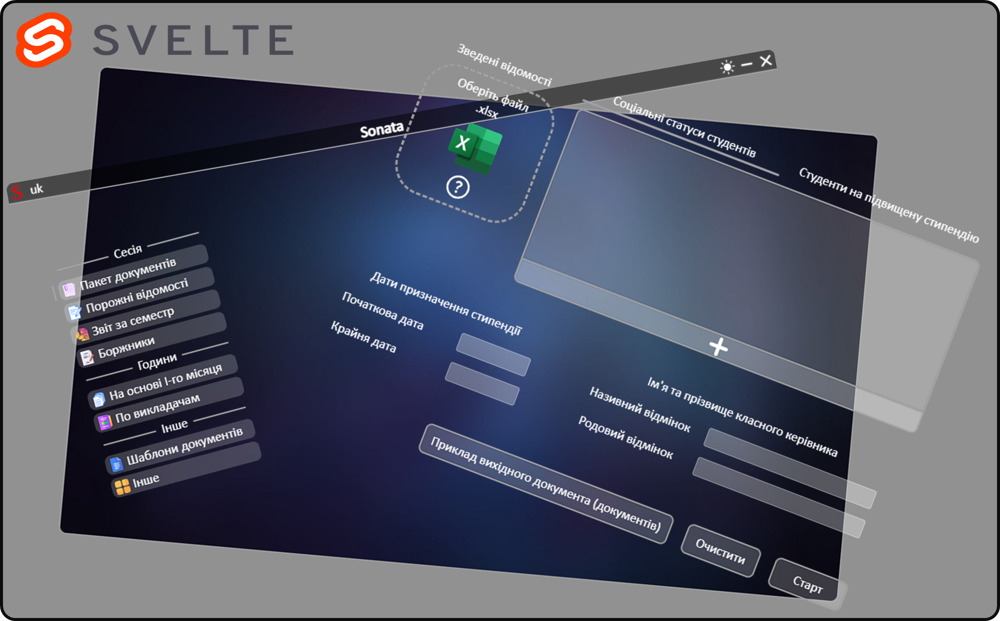

# Sonata

| EN [English](en/README.md) | UK [Українська](README.md) | RU [Русский](ru/README.md) |
|---|---|---|

Працюйте з документами, заощаджуючи до 95% часу з програмним забеспеченням для фахових коледжів!

## Переваги:
 * Програма побудована на базі Electron та Svelte, що забезпечує модульність користувацького інтерфейсу та чітке розділення логіки між окремими компонентами.

## Можливості
### Сесія:
 * Створення повного пакету документів (зведена відомість, рейтингова відомість, клопотання, подання, рейтинг на сайт) для певної групи студентів під час сесії;
 * Створення порожніх зведених відомостей;
 * Створення звіту щодо успішності студентів усіх груп за семестр;
 * Створення звіту студентів, які за результатами семестру виявилися неатестованими.
### Години ведення пар:
 * Створення годин на весь семестр на основі годин першого сесемтру;
 * Створення звіту по годинам з усіх груп по викладачам.
### Інше:
 * Завантаження порожніх документів для заповнення і подальшого використання, у тому числі у Sonata;
 * Створення скріншотів з документу Excel зі справжнім підвищенням якості;
 * Створення документу графіку тижнів чисельник/знаменник.

## Використання

Після запуску потрібно обрати необхідний розділ з меню програми та працювати з інтерфейсом  
Вигляд інтерфейсу після запуску програми:

## Документація
| Посилання | Опис |
|---|---|
|[Пакет документів](package_of_documents.md) | Створення повного пакету документів |
|[Порожні відомості](empty_statements.md) | Створення порожніх зведених відомостей |
|[Створення звіту](report.md) | Створення звіту щодо успішності студентів усіх груп за семестр |
|[Створення звіту](debtors.md) | Створення звіту щодо неатестованих студентів |
|[Створення годин](based_on_the_first_month.md) | Створення годин на весь семестр |
|[Створення звіту](summary_of_teachers.md) | Створення звіту по годинам |
|[Завантаження порожніх документів](templates.md) | Завантаження порожніх документів |
|[Інше](other.md) | Створення скріншотів та документу графіку чисельник/знаменник |
|[Додатково](additionally.md) | Додаткові модулі програми |

## Структура програми

Програма працює на основі Electron у зв'язці Svelte + NodeJS + Python/C#:
 * Після запуску програми запускається Python-сервер у режимі очікування команд, процес якого закріплюється за процесом Electron
 * Інтерфейс користувача побудований на Svelte
 * Вхідні файли від користувача проходять перевірку та отримання даних у NodeJS
 * Після натискання кнопки "Старт" кінцеві дані від користувача проходять через фінальне доповнення та розрахунки у NodeJS перед відправкою у Python
 * Робота з файлами виконується на сервері Python
 * Кінцевий результат формується у відповідь та повертається у NodeJS. З NodeJS відповідь направляється користувачеві на інтерфейс Svelte
 * Увімкнення режиму скріншота відбувається у NodeJS після надсилання команди від Svelte. NodeJS слідкує за буфером обміну і при фіксуванні діапазону клітинок NodeJS викликає кастомне вікно збереження файлу через C# з передачей параметрів. Після згоди користувача C# повертає у NodeJS дані. Після цього NodeJS за допомогою скриптів PowerShell через управління Microsoft Excel формує зображення зі збереженням у тимчасовий каталог і надсилає серверу Python команду для додавання полей у зображення і збереження у каталог, що було повернуто з вікна збереження на C#.

