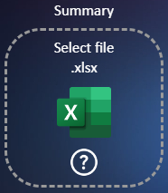
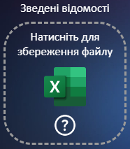
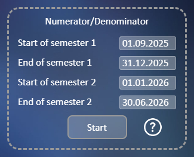
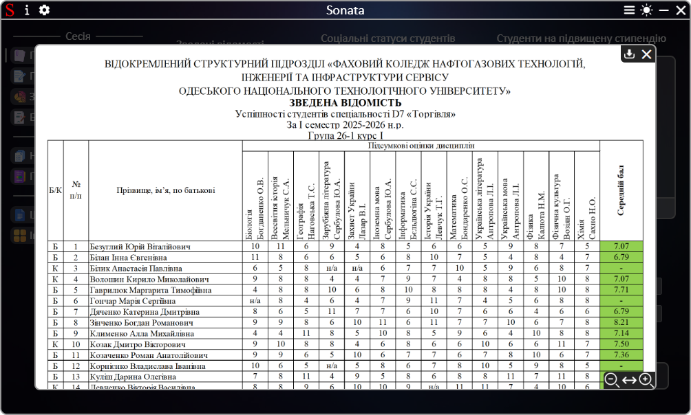
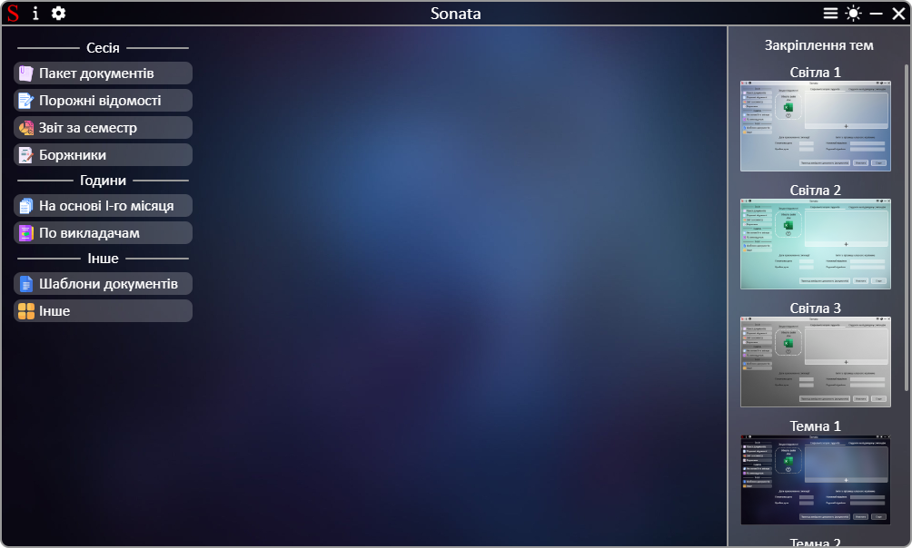
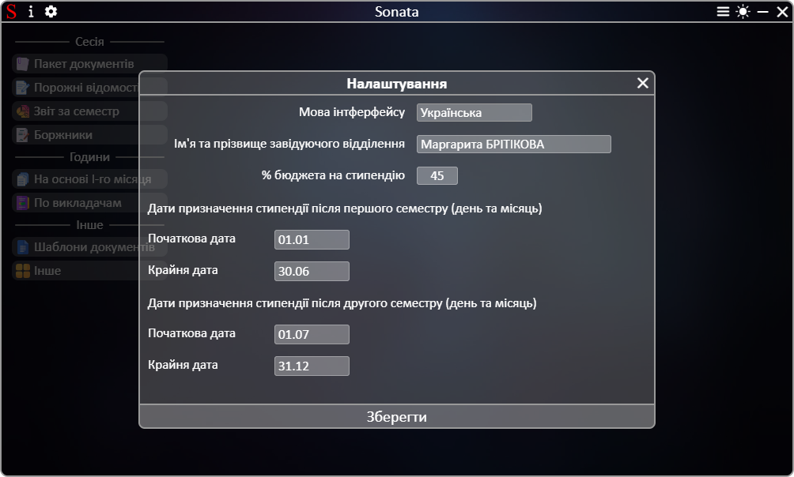
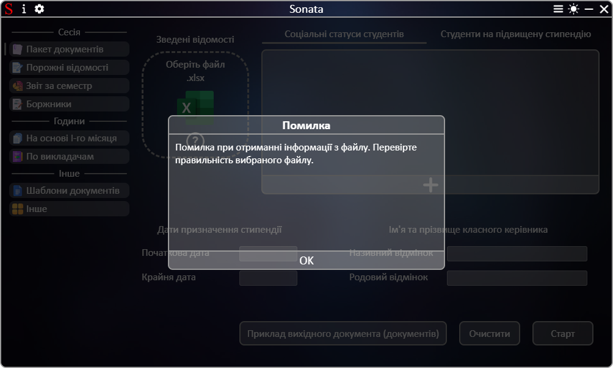

# **[←](README.md)**

# Додаткові модулі додаток

| EN [English](en/additionally.md) | UK [Українська](additionally.md) | RU [Русский](ru/additionally.md) |
| -------------------------------- | -------------------------------- | -------------------------------- |

## Додаток містить такі модулі:

### Вікно прикладу файла для завантаження/збереження на пристрій

Відкрити це вікно можна шляхом натискання на кнопку зі знаком питання:

  

При натисканні на знак питання відкривається вікно з відображенням прикладу документа.
У цьому вікні можно:

- змінювати масштаб зображення шляхом натискання Ctrl та прокрутки колесиком миші;
- змінювати положення зображення по вертикалі (прокрутка колесиком миші) та по горизонталі (Shift + прокрутка колесиком миші);
- відобразити різні зображення шляхом натискання на відповідну назву на панелі зліва знизу (якщо така є);
- змінити масштаб та встановити масштаб зображення по ширині вікна шляхом натискання на кнопки зправа знизу;
- зберегти файл на пристрій шляхом натискання кнопки збереження (якщо така є);
- закрити вікно шляхом натискання на кнопку закриття.

_example_window.png>)

### Закріплення тем

У додатку встановлено декілька світлих та темних тем. Змінити темну/світлу тему на іншу темну/світлу тему можно шляхом закріплення до поточної теми (темна/світла) однієї серед запропонованих у меню закріплення тем. Щоб відкрити меню потрібно натиснути на кнопку зправа зверху додатку біля перемикача теми:

Під час світлої теми можно закріпити за нею лише теми з назвою "Світла". Під час темної - з назвою "Темна".
Закріпити світлу тему за темною та навпаки неможно. Закріплення теми зберігається на наступні запуски додатку.

### Налаштування додатку

Змінити переклад додатку та вказати інші параметри можно у налаштуваннях. Налаштування відкриваються шляхом натискання на відповідну кнопку зліва зверху додатку біля іконки:

Після вибору мови додаток відразу перекладається.
Зберегти налаштування можно:

- до закриття додатку шляхом натиснення на кнопку закриття вікна налаштувань;
- на наступні запуски додатку шляхом натиснення на кнопку "Зберегти".

### Вікно помилки чи попередження

Під час роботи додаток перевіряє вхідні дані та у разі помилки виводить повідомлення користувачу. Якщо вхідні дані вірні але під час роботи додатку трапилася помилка користувач теж отримає повідомлення про помилку чи попередження.  
Приклад вікна помилки/попередження:

# **[←](README.md)**
