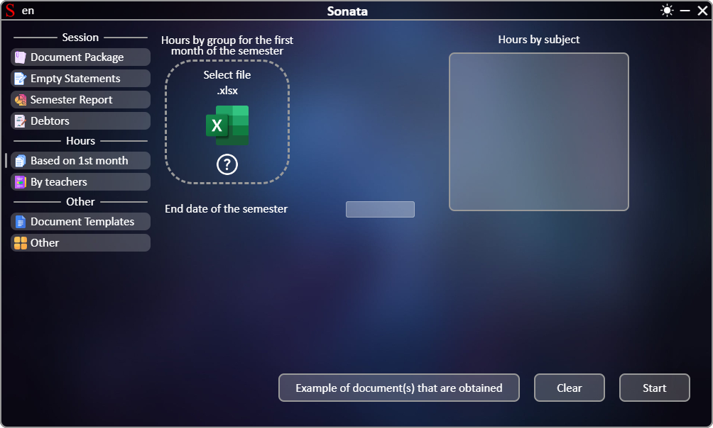
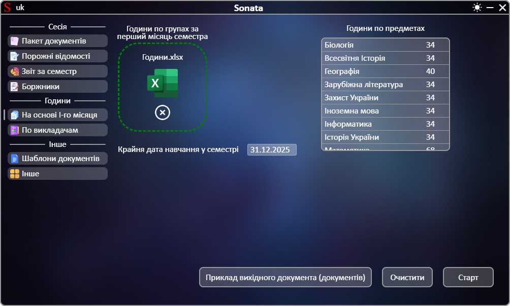

# **[←](README.md)**

# Створення годин на весь семестр на основі годин першого сесемтру

| EN [English](en/based_on_the_first_month.md) | UK [Український](based_on_the_first_month.md) | RU [Русский](ru/based_on_the_first_month.md) |
|---|---|---|

Порожня сторінка:

## На сторінці потрібно:
 * Завантажити файли шляхом переміщення файлу до області елементу "Оберіть файл" чи натисканням на цю область;
 * Перевірити список отриманих годин для предметів з файлу та за необхідності відредагувати кількість годин шляхом натискання на число;
 * Перевірити автоматично розраховану крайню дату навчання у семестрі та за необхідності відредагувати шляхом натискання на дату.

Приклад заповненої сторінки:

# **[←](README.md)**