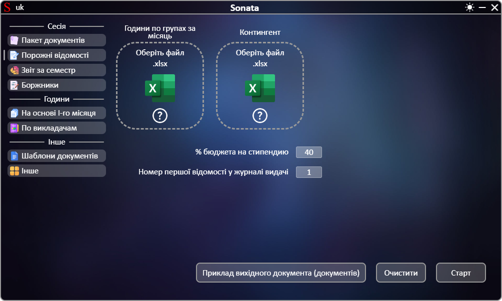
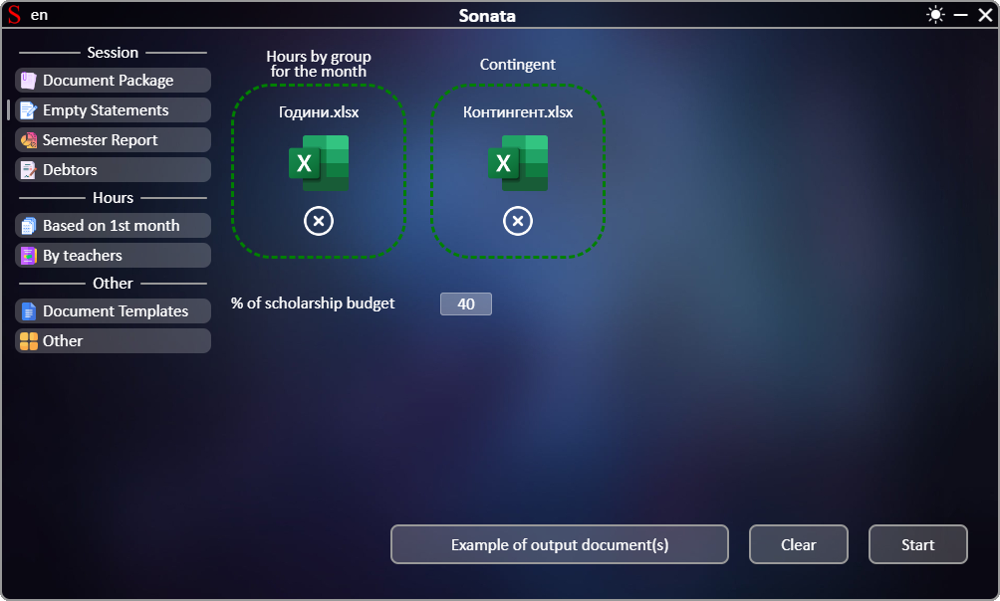

# **[←](README.md)**

# Порожні відомості

| EN [English](en/empty_statements.md) | UK [Українська](empty_statements.md) | RU [Русский](ru/empty_statements.md) |
|---|---|---|

Порожня сторінка:

## На сторінці потрібно:
 * Завантажити файли шляхом переміщення файлу до області елементу "Оберіть файл" чи натисканням на цю область;
 * Перевірити автоматично введений % місць на стипендію відносно бюджетних місць та за необхідності відредагувати дані шляхом натискання на число.

Приклад заповненої сторінки:

# **[←](README.md)**