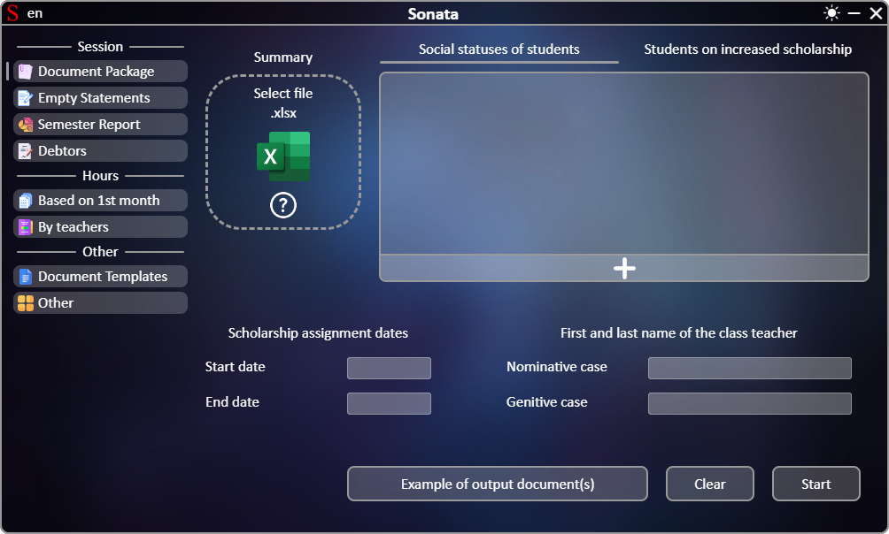
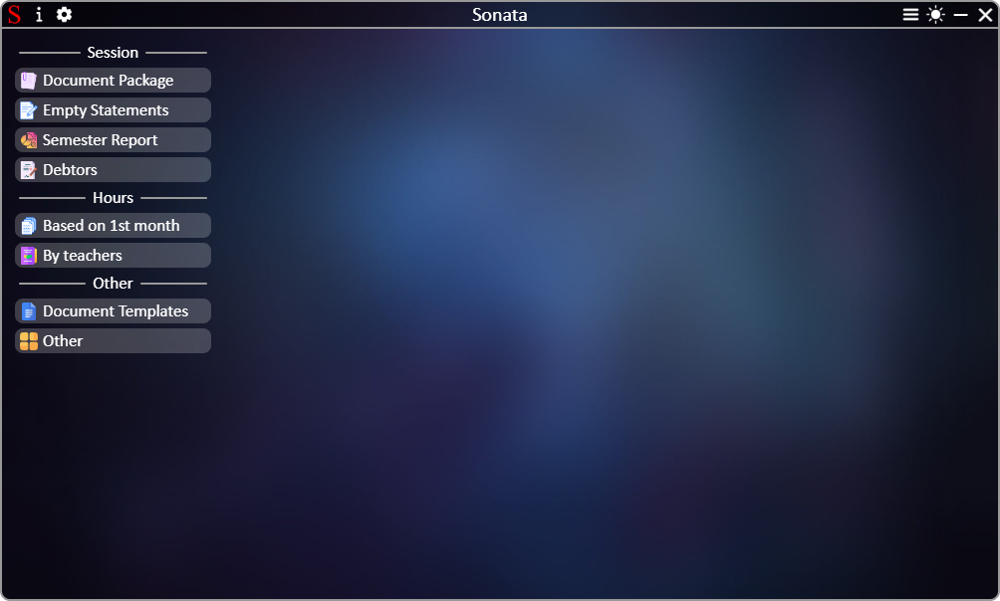

# Sonata

| EN [English](README.md) | UK [Український](../README.md) | RU [Русский](../ru/README.md) |
|---|---|---|

Work with documents, saving up to 95% of time with software for professional colleges!

## Features
### Session:
 * Creating a complete package of documents (summary sheet, rating sheet, petition, submission, site rating) for a specific group of students during the session;
 * Creating empty summary sheets;
 * Creating a report on the performance of students of all groups for the semester;
 * Creating a report on students who, according to the results of the semester, were not certified.
### Pairing hours:
 * Creating hours for the entire semester based on the hours of the first semester;
 * Creating a report on hours from all groups by teacher.
### Other:
 * Downloading empty documents for filling in and further use, including in Sonata;
 * Creating screenshots from an Excel document with real quality improvement;
 * Creating a document of the numerator/denominator week schedule.

## Usage

After launching, you need to select the necessary section from the program menu and work with the interface
Interface appearance after launching the program:

## Documentation
| Links | Description |
|---|---|
|[Document package](package_of_documents.md) | Creating a complete package of documents |
|[Empty statements](empty_statements.md) | Creating empty summary statements |
|[Create a report](report.md) | Creating a report on the performance of students of all groups for the semester |
|[Create a report](debtors.md) | Creating a report on uncertified students |
|[Create hours](based_on_the_first_month.md) | Creating hours for the entire semester |
|[Create a report](summary_of_teachers.md) | Creating a report by hours |
|[Load empty documents](templates.md) | Loading empty documents |
|[Other](other.md) | Creating screenshots and a document of the numerator/denominator graph |
|[Additionally](additionally.md) | Additional program modules |

## Program structure

The program is based on Electron in a combination of Svelte + NodeJS + Python/C#:
 * After starting the program, a Python server is started in command waiting mode, the process of which is attached to the Electron process.
 * The user interface is built on Svelte
 * Input files from the user are checked and data is received in NodeJS
 * After pressing the "Start" button, the final data from the user goes through final addition and calculations in NodeJS before being sent to Python
 * Work with files is performed on the Python server
 * The final result is formed in response and returned to NodeJS. From NodeJS, the response is sent to the user on the Svelte interface
 * Enabling the screenshot mode occurs in NodeJS after sending a command from Svelte. NodeJS monitors the clipboard and when fixing a range of cells, NodeJS calls a custom file saving window via C# with the transfer of parameters. After the user consents, C# returns data to NodeJS. After that, NodeJS, using PowerShell to control Microsoft Excel, generates an image and saves it to a temporary directory and sends a command to the Python server to add fields to the image and save it to the directory, which was returned from the C# save window.

