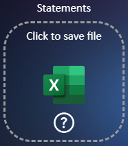
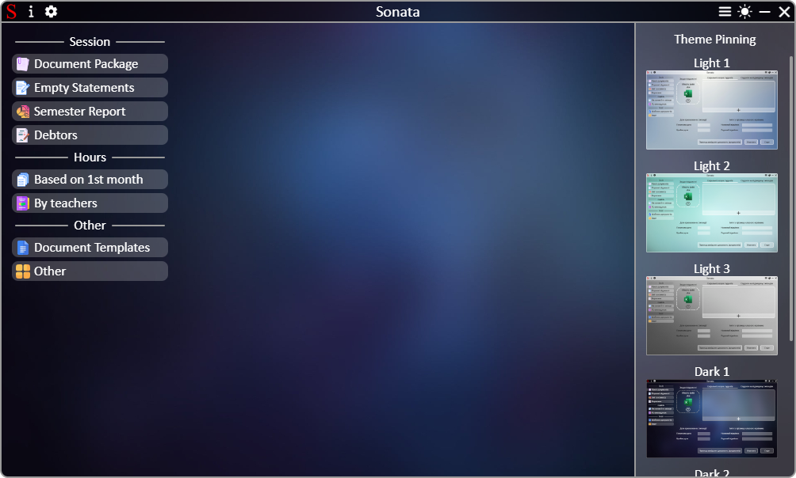
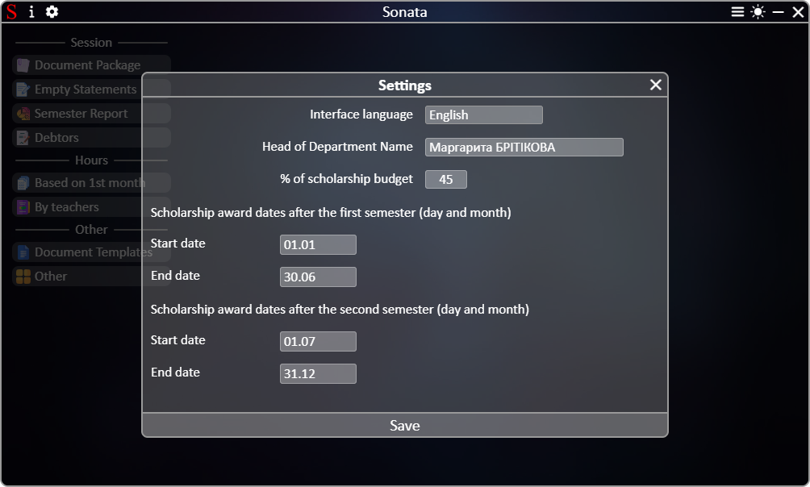
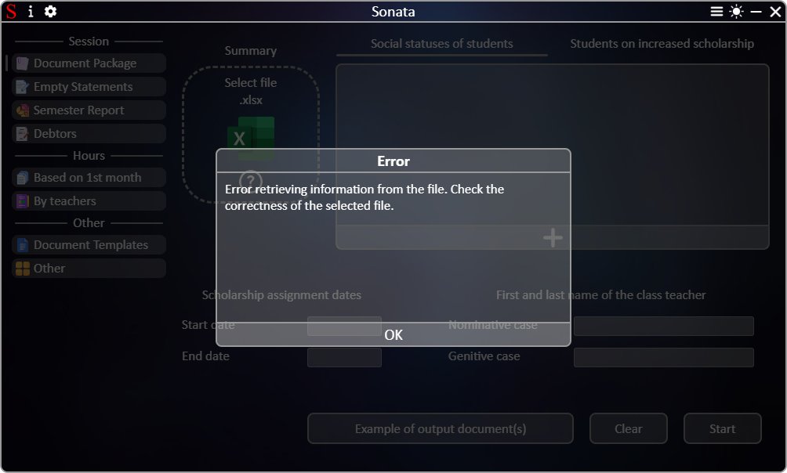

# **[←](README.md)**

# Additional app modules

| EN [English](additionally.md) | UK [Українська](../additionally.md) | RU [Русский](../ru/additionally.md) |
| ----------------------------- | ----------------------------------- | ----------------------------------- |

## The app contains the following modules:

### Window of an example file for loading/saving to the device

You can open this window by clicking on the button with a question mark:

  

When you click on the question mark, a window opens displaying an example document.
In this window, you can:

- change the image scale by pressing Ctrl and scrolling with the mouse wheel;
- change the image position vertically (scroll with the mouse wheel) and horizontally (Shift + scroll with the mouse wheel);
- display different images by clicking on the corresponding name in the panel at the bottom left (if any);
- change the scale and set the image scale to the width of the window by clicking on the buttons at the bottom right;
- save the file to the device by clicking the save button (if any);
- close the window by clicking on the close button.

_example_window.png>)

### Pinning themes

The application has several light and dark themes installed. You can change the dark/light theme to another dark/light theme by pinning one of the themes offered in the pinning menu to the current theme (dark/light). To open the menu, click on the button at the top right of the application near the theme switch:

During the light theme, you can pin only themes with the name "Light". During the dark theme - with the name "Dark".
You cannot pin a light theme to a dark theme and vice versa. The theme pinning is saved for subsequent launches of the application.

### Application settings

You can change the application translation and specify other parameters in the settings. The settings are opened by clicking on the corresponding button at the top left of the application near the icon:

After selecting a language, the application is immediately translated.
You can save the settings:

- until you close the application by clicking the close button of the settings window;
- for subsequent launches of the application by clicking the "Save" button.

### Error or warning window

During operation, the app checks the input data and displays a message to the user in case of an error. If the input data is correct but an error occurs during operation, the user will also receive an error or warning message.
Example of an error/warning window:

# **[←](README.md)**
