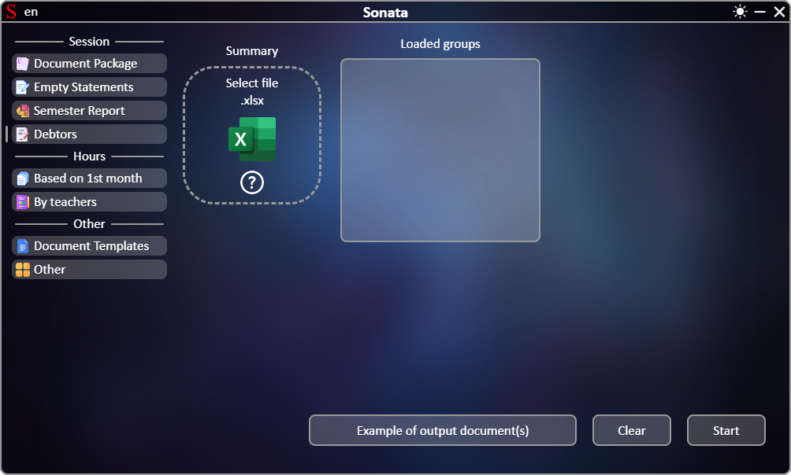
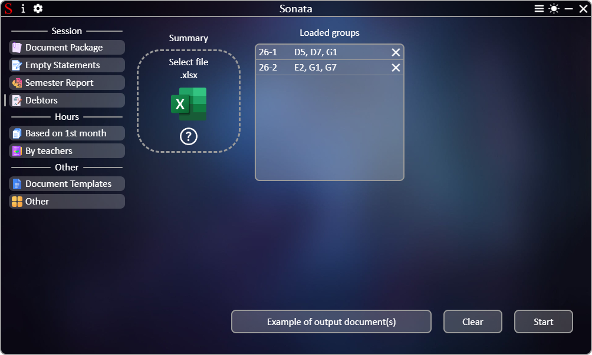

# **[←](README.md)**

# Creating a report of students who were not certified according to the results of the semester

| EN [English](debtors.md) | UK [Українська](../debtors.md) | RU [Русский](../ru/debtors.md) |
|---|---|---|

Blank page:

## On the page you need to:
 * Upload files by dragging the file to the "Select file" element area or by clicking on this area;
 * Check the list of received data from files and, if necessary, delete elements by clicking on the "✕" button.

Example of a completed page:

# **[←](README.md)**