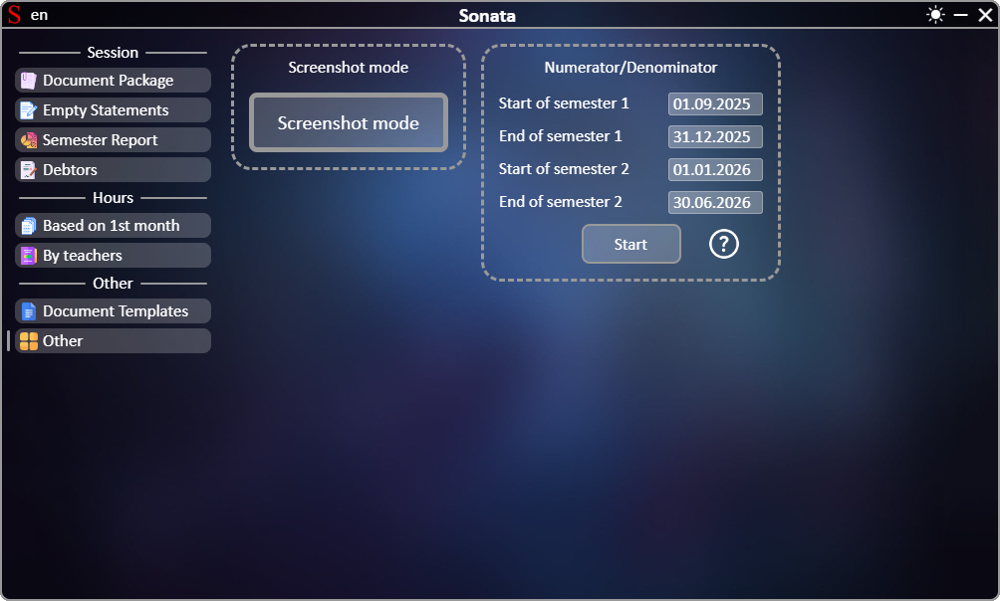

# **[←](README.md)**

# Other

| EN [English](other.md) | UK [Українська](../other.md) | RU [Русский](../ru/other.md) |
|---|---|---|

## On the page you can:
 * Enable screenshot mode. After enabling the mode, all subsequent copying of the range of cells in Microsoft Excel will call the window for saving them as an image. In the window, you can specify the quality increase factor (by 2 times, by 3 times, etc.) from 1 (no change) to 10 (10 times increase in quality), the default is a factor of 5;
 * Generate a document of the schedule of weeks numerator/denominator. Before this, you need to check the automatically calculated start and end dates of the semesters and, if necessary, edit them by clicking on the date.

Example page:

# **[←](README.md)**