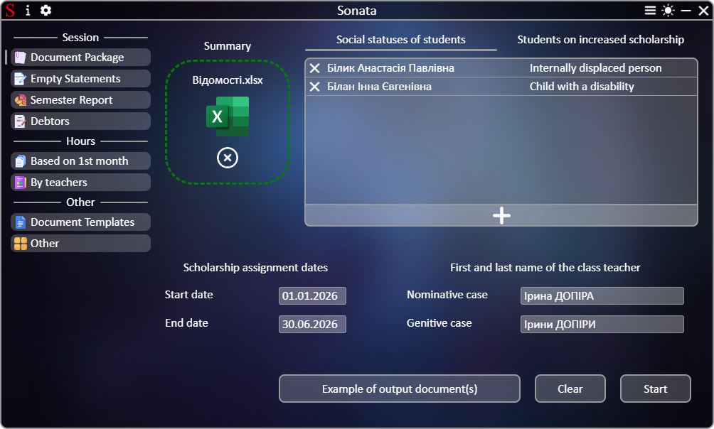

# **[←](README.md)**

# Creating a complete package of documents

| EN [English](package_of_documents.md) | UK [Українська](../package_of_documents.md) | RU [Русский](../ru/package_of_documents.md) |
|---|---|---|

Blank page:

## On the page you need to:
 * Upload the file by dragging the file to the "Choose file" element area or by clicking on this area;
 * Check the automatically calculated start and end dates of the scholarship award. Edit the data in case of an error by clicking on the text and changing it;
 * Check the received surname, name of the class teacher and its automatically created genitive case. Edit the data in case of an error by clicking on the text and changing it;
 * Fill in the list of social statuses of students and the list of students on an increased scholarship:
   - Creating a new list item is done by clicking on the button with "+";
   - To fill in an item, you need to click on the items of the item with the word "Select" and select the appropriate parameter in the pop-up list;
   - List items can be deleted by clicking on the "✕" button;
   - You can manually enter the social status by clicking on the button with a pencil next to the social status (the pencil is displayed when you hover the mouse over the social status).

Example of a filled page:

# **[←](README.md)**