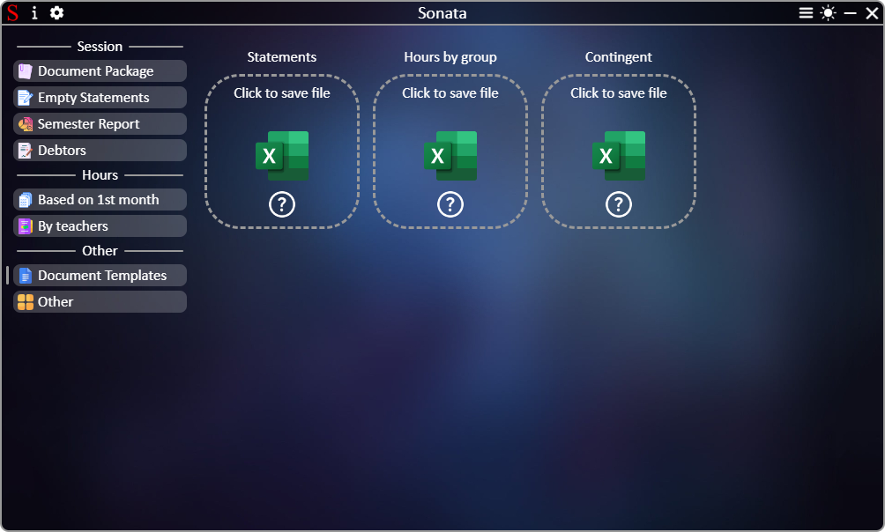

# **[←](README.md)**

# Loading blank documents

| EN [English](templates.md) | UK [Українська](../templates.md) | RU [Russian](../ru/templates.md) |
| -------------------------- | -------------------------------- | -------------------------------- |

## On the page you can:

- Save empty files to the device, which can be used in the Sonata app later

Page:

# **[←](README.md)**
