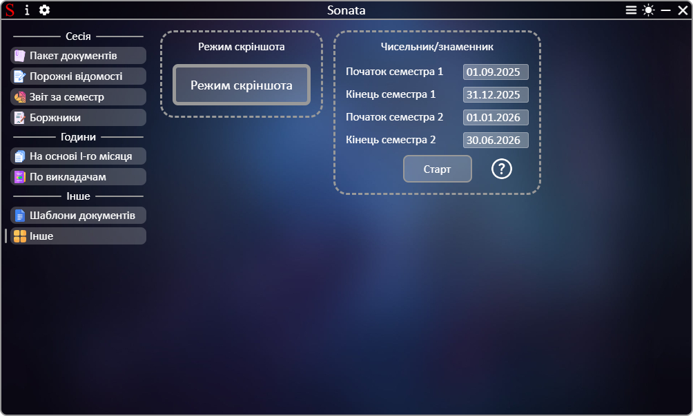

# **[←](README.md)**

# Інше

| EN [English](en/other.md) | UK [Українська](other.md) | RU [Русский](ru/other.md) |
| ------------------------- | ------------------------- | ------------------------- |

## На сторінці можно:

- Увімкнути режим скріншоту. Після увімкнення режиму усі наступні копіювання діапазону клітинок у додатку Microsoft Excel будуть викликати вікно їх збереження як зображення. У вікні можна вказати коефіцієнт збільшення якості (у 2 рази, у 3 рази і т.д.) від 1 (без змін) до 10 (підвищення якості у 10 разів), за замовчуванням стоїть коефіцієнт 5;
- Сформувати документ графіку тижнів чисельник/знаменник. Перед цим потрібно перевірити автоматично розраховані дати початку та кінця семестрів та за необхідності відредагувати їх шляхом натискання на дату.

Приклад сторінки:

# **[←](README.md)**
