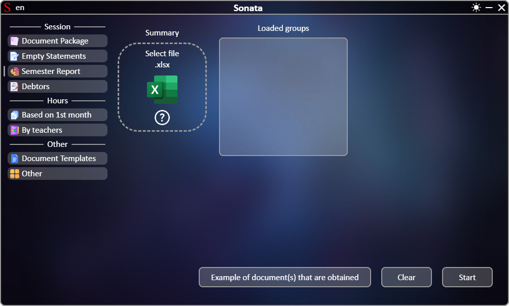
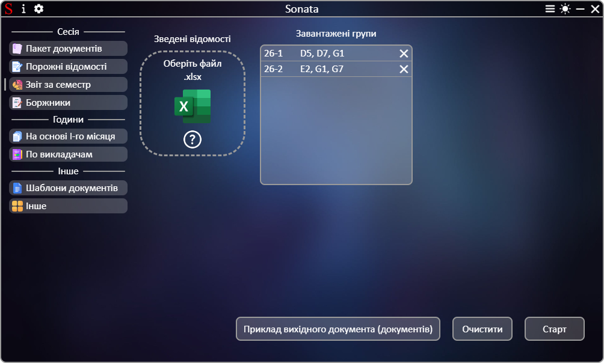

# **[←](README.md)**

# Створення звіту щодо успішності студентів усіх груп за семестр

| EN [English](en/report.md) | UK [Українська](report.md) | RU [Русский](ru/report.md) |
|---|---|---|

Порожня сторінка:

## На сторінці потрібно:
 * Завантажити файли шляхом переміщення файлу до області елементу "Оберіть файл" чи натисканням на цю область;
 * Перевірити список отриманих даних з файлів та за необхідності видалити елементи через натискання на кнопку "✕".

Приклад заповненої сторінки:

# **[←](README.md)**