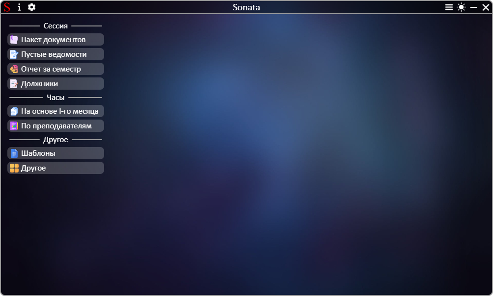
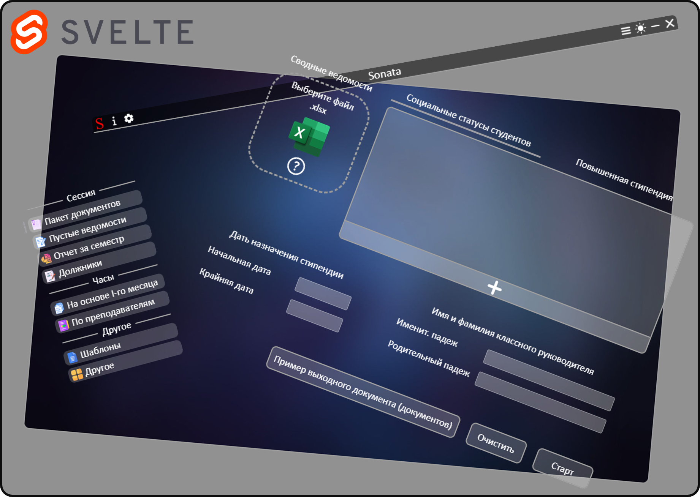
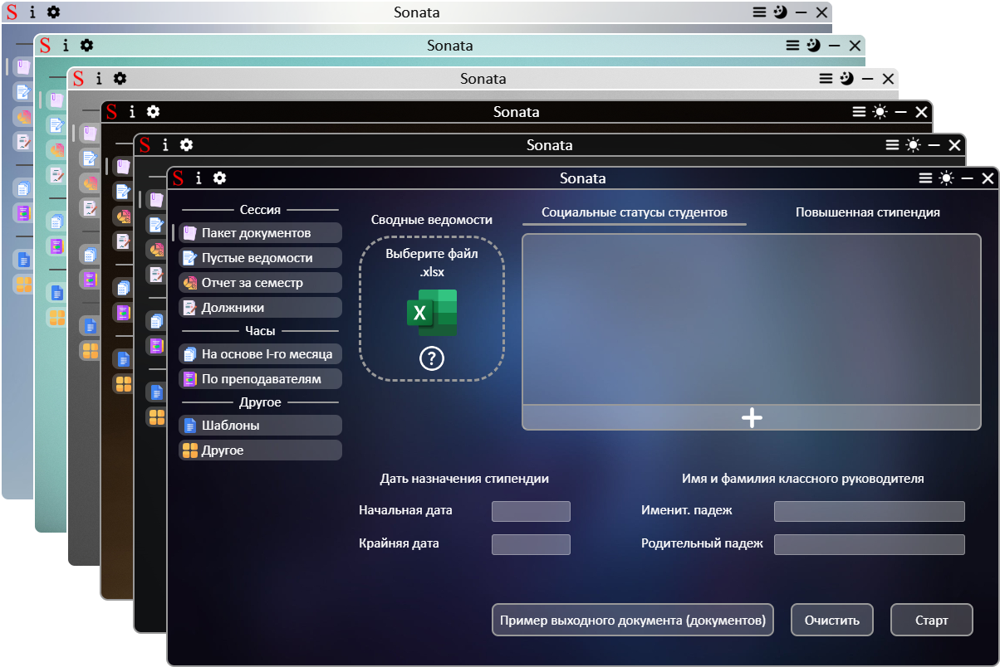
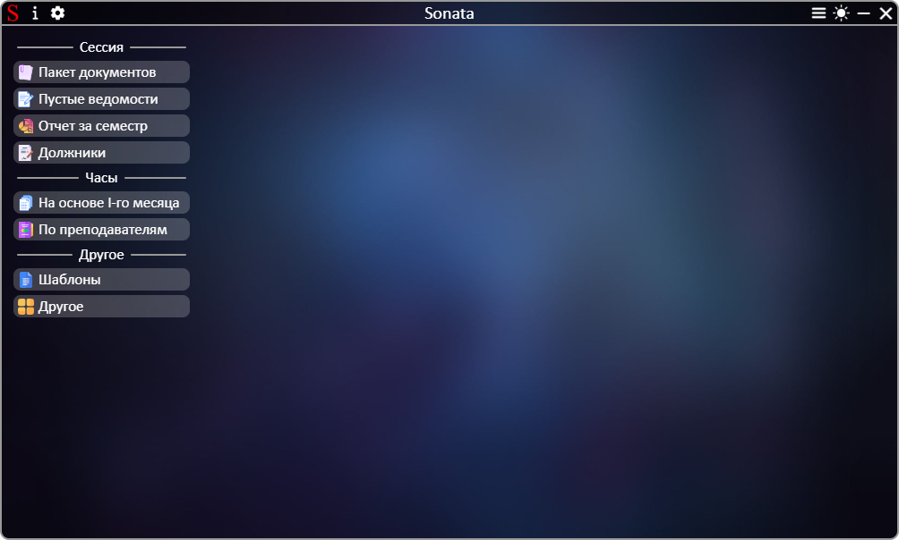
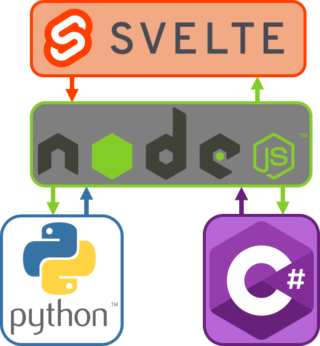

# Sonata

| EN [English](../en/README.md) | RU [Українська](../README.md) | RU [Русский](README.md) |
| ----------------------------- | ----------------------------- | ----------------------- |

Работайте с документами, экономя до 95% времени с программным обеспечением для профессиональных колледжей!

## Преимущества

- Программа построена на базе Electron и Svelte, что обеспечивает модульность пользовательского интерфейса и четкое разделение логики между отдельными компонентами.

- Приложение содержит несколько тем, что увеличивает кастомизацию интерфейса.

## Возможности

### Сессия:

- Создание полного пакета документов (сводная ведомость, рейтинговая ведомость, ходатайство, представление, рейтинг на сайт) для определенной группы студентов во время сессии;
- создание пустых сводных ведомостей;
- Создание отчета об успешности студентов всех групп за семестр;
- Создание отчета студентов, которые по результатам семестра оказались неаттестованными.

### Часы ведения пар:

- создание часов на весь семестр на основе часов первого сесемтра;
- Создание отчета по часам из всех групп по преподавателям.

### Другое:

- Загрузка пустых документов для заполнения и последующего использования, в том числе в Sonata;
- Создание скриншотов из документа Excel с подлинным повышением качества;
- Создание документа графика недель числитель/знаменатель.

## Использование

После запуска необходимо выбрать необходимый раздел из меню приложения и работать с интерфейсом
Вид интерфейса после запуска приложения:

## Документация

| Ссылки                                        | Описание                                                      |
| --------------------------------------------- | ------------------------------------------------------------- |
| [Пакет документов](package_of_documents.md)   | Создание полного пакета документов                            |
| [Пустые ведомости](empty_statements.md)       | Создание пустых сводных ведомостей                            |
| [Создание отчета](report.md)                  | Создание отчета об успешности студентов всех групп за семестр |
| [Создание отчета](debtors.md)                 | Создание отчета по неаттестованным студентам                  |
| [Создание часов](based_on_the_first_month.md) | Создание часов на весь семестр                                |
| [Создание отчета](summary_of_teachers.md)     | Создание отчета по часам                                      |
| [Загрузка пустых документов](templates.md)    | Загрузка пустых документов                                    |
| [Другое](other.md)                            | Создание скриншотов и документ графика числитель/знаменатель  |
| [Дополнительно](additionally.md)              | Дополнительные модули приложения                              |

## Структура приложения

Программа работает на основе Electron в связке Svelte + NodeJS + Python/C#:

- После запуска приложения запускается Python-сервер в режиме ожидания команд, процесс которого закрепляется за процессом Electron
- Пользовательский интерфейс построен на Svelte
- Входящие файлы от пользователя проходят проверку и получение данных в NodeJS
- После нажатия кнопки "Старт" конечные данные от пользователя проходят через финальное дополнение и расчеты в NodeJS перед отправкой в ​​Python
- Работа с файлами выполняется на сервере Python
- Конечный результат формируется в ответ и возвращается в NodeJS. С NodeJS ответ направляется пользователю на интерфейс Svelte
- Включение режима скриншота происходит в NodeJS после отправки команды от Svelte. NodeJS следит за буфером обмена и при фиксировании диапазона ячеек NodeJS вызывает кастомное окно сохранения файла через C# с передачей параметров. После согласия пользователя C# возвращает данные в NodeJS. После этого NodeJS с помощью скриптов PowerShell управляет Microsoft Excel, формирует изображение с сохранением во временный каталог и отправляет серверу Python команду для добавления полей в изображение и сохранения в каталог, возвращенного из окна сохранения на C#.

