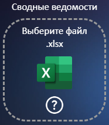
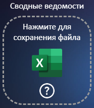
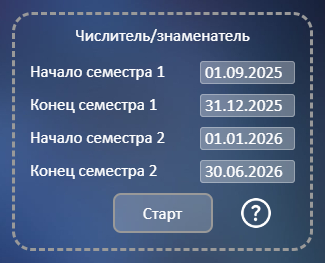
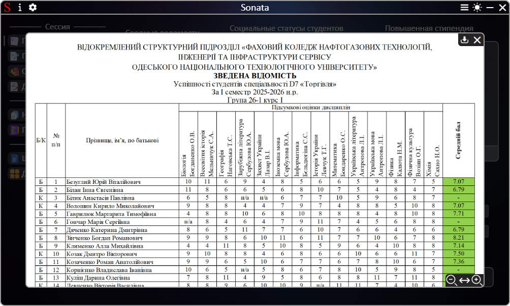
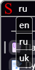
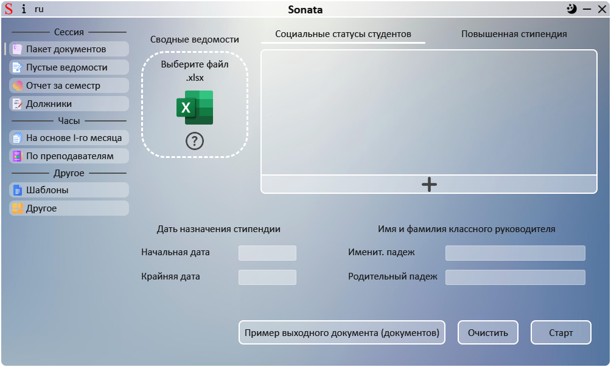
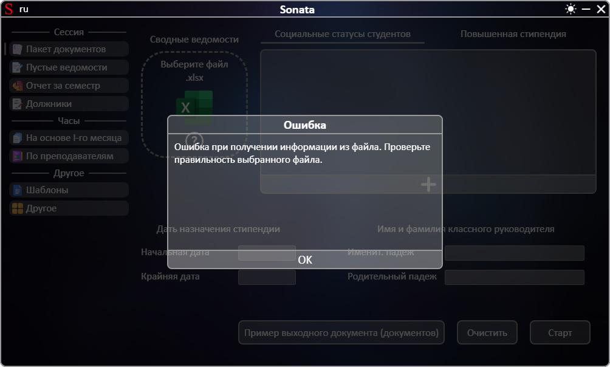

# **[←](README.md)**

# Дополнительные модули программы

| EN [English](../en/additionally.md) | UK [Українська](../additionally.md) | RU [Русский](additionally.md) |
|---|---|---|

## Программа содержит следующие модули:

### Окно примера файла для загрузки/сохранения на устройство

Открыть это окно можно путем нажатия на кнопку со знаком вопроса:

  

При нажатии на вопросительный знак открывается окно с отображением примера документа.
В этом окне можно: 
 - изменять масштаб изображения путем нажатия Ctrl и прокрутки колесиком мыши; 
 - изменять положение изображения по вертикали (прокрутка колесом мыши) и по горизонтали (Shift + прокрутка колесом мыши); 
 - отобразить разные изображения путем нажатия на соответствующее название на панели слева снизу (если такое есть); 
 - изменить масштаб и установить масштаб изображения по ширине окна путем нажатия на кнопки справа снизу; 
 - сохранить файл на устройство путем нажатия кнопки сохранения (если таковая есть); 
 - закрыть окно путем нажатия на кнопку закрытия.

_example_window.png)

### Перевод программы

Изменить перевод программы можно путем нажатия на соответствующую кнопку слева сверху у логотипа и выбора желаемого языка среди предложенных:

После выбора языка приложение сразу переводится.

### Изменение темы программы

Изменить тему с темной на светлую и наоборот можно нажатием на соответствующую кнопку справа сверху программы возле кнопки свертывания:

### Окно ошибки или предупреждения

Во время работы программа проверяет входящие данные и в случае ошибки выводит сообщение пользователю. Если входные данные верны, но при работе программы произошла ошибка пользователь тоже получит сообщение об ошибке или предупреждении.
Пример окна ошибки/предупреждения:

# **[←](README.md)**