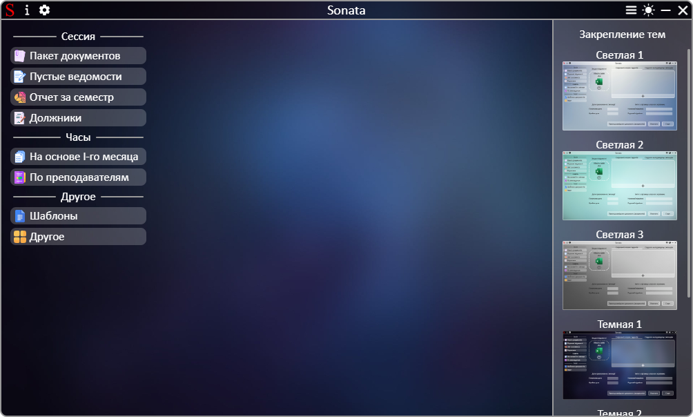
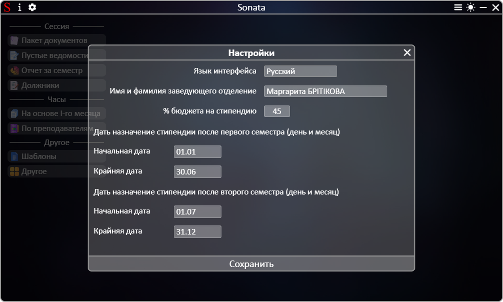

# **[←](README.md)**

# Дополнительные модули приложения

| EN [English](../en/additionally.md) | UK [Українська](../additionally.md) | RU [Русский](additionally.md) |
| ----------------------------------- | ----------------------------------- | ----------------------------- |

## Программа содержит следующие модули:

### Окно примера файла для загрузки/сохранения на устройство

Открыть это окно можно путем нажатия на кнопку со знаком вопроса:

  

При нажатии на вопросительный знак открывается окно с отображением примера документа.
В этом окне можно:

- изменять масштаб изображения путем нажатия Ctrl и прокрутки колесиком мыши;
- изменять положение изображения по вертикали (прокрутка колесом мыши) и по горизонтали (Shift + прокрутка колесом мыши);
- отобразить разные изображения путем нажатия на соответствующее название на панели слева снизу (если такое есть);
- изменить масштаб и установить масштаб изображения по ширине окна путем нажатия на кнопки справа снизу;
- сохранить файл на устройство путем нажатия кнопки сохранения (если таковая есть);
- закрыть окно путем нажатия на кнопку закрытия.

_example_window.png>)

### Закрепление тем

В приложении установлено несколько светлых темных тем. Изменить темную/светлую тему на другую темную/светлую тему можно путем закрепления к текущей теме (темная/светлая) одной из предложенных в меню закрепления тем. Чтобы открыть меню, нужно нажать на кнопку справа сверху приложения возле переключателя темы:

Во время светлой темы можно закрепить за ней только темы под названием "Светлая". Во время темной – с названием "Темная".
Закрепить светлую тему за темной и наоборот нельзя. Закрепление темы сохраняется на последующих запусках приложения.

### Настройка приложения

Изменить перевод приложения и указать другие параметры можно в настройках. Настройки открываются нажатием на соответствующую кнопку слева сверху приложения у иконки:

После выбора языка приложение сразу переводится.
Сохранить настройки можно:

- до закрытия приложения путем нажатия на кнопку закрытия окна настроек;
- на последующие запуски приложения путем нажатия кнопки "Сохранить".

### Окно ошибки или предупреждения

Во время работы приложение проверяет входящие данные и в случае ошибки выводит сообщение пользователю. Если входные данные верны, но при работе приложения произошла ошибка пользователь тоже получит сообщение об ошибке или предупреждении.
Пример окна ошибки/предупреждения:

# **[←](README.md)**
