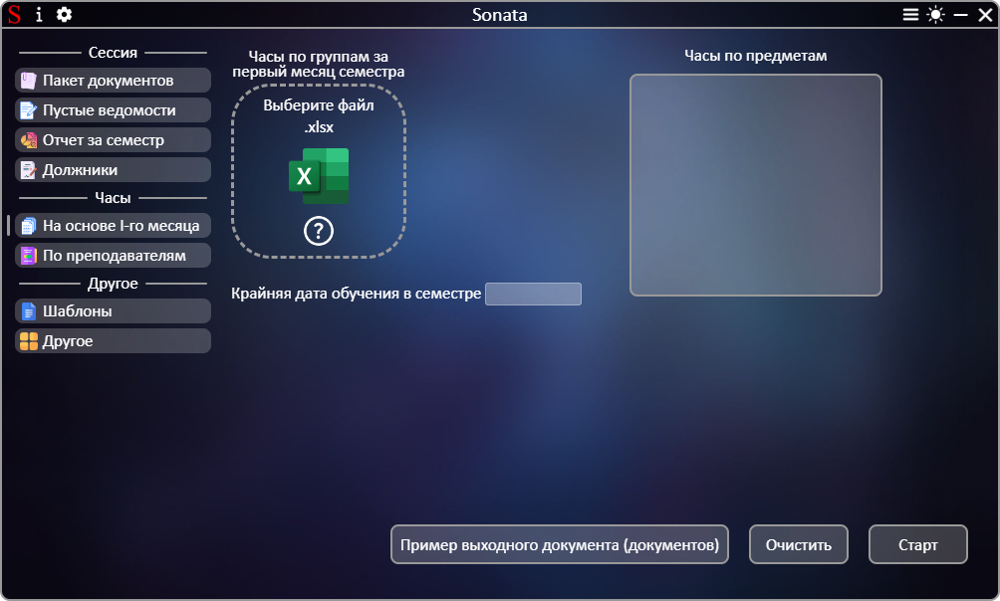
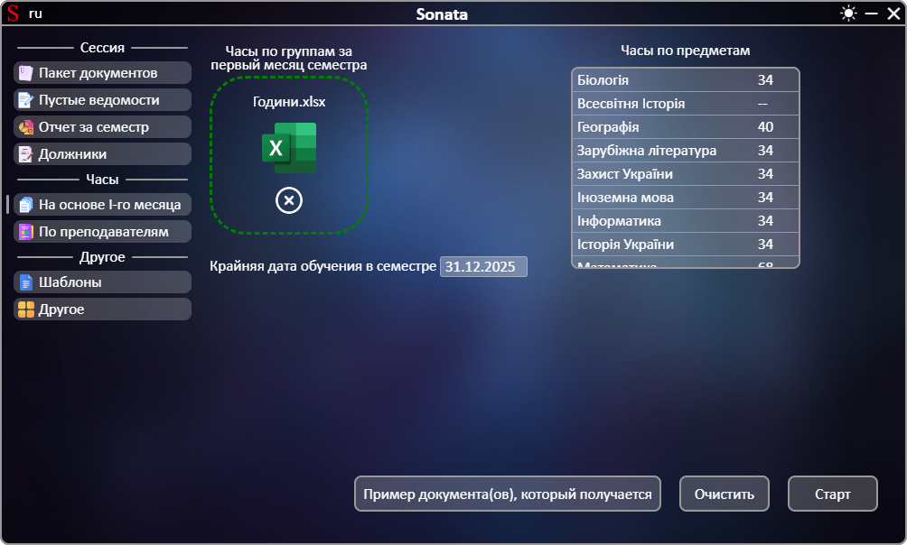

# **[←](README.md)**

# Создание часов на весь семестр на основе часов первого сесемтра

| EN [English](../en/based_on_the_first_month.md) | UK [Українська](../based_on_the_first_month.md) | RU [Русский](based_on_the_first_month.md) |
|---|---|---|

Пустая страница:

## На странице нужно: 
 * Загрузить файлы путем перемещения файла в область элемента "Выберите файл" или нажатием на эту область; 
 * проверить список полученных часов для предметов из файла и при необходимости отредактировать количество часов путем нажатия на число; 
 * Проверить автоматически рассчитанную крайнюю дату обучения в семестре и при необходимости отредактировать нажатием на дату.

Пример заполненной страницы:

# **[←](README.md)**