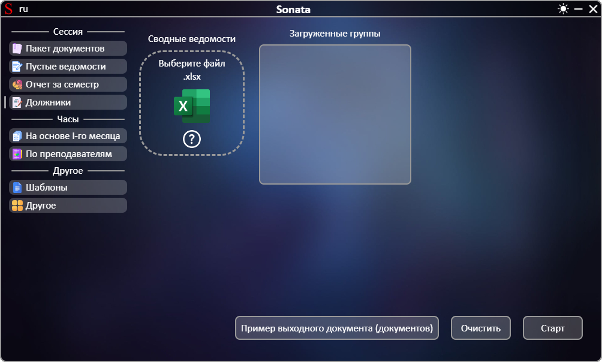
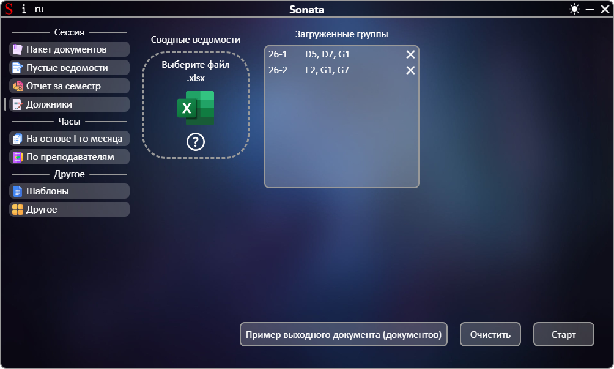

# **[←](README.md)**

# Создание отчета студентов, которые по результатам семестра оказались неаттестованными

| EN [English](../en/debtors.md) | UK [Український](../debtors.md) | RU [Русский](debtors.md) |
|---|---|---|

Пустая страница:

## На странице нужно: 
 * Загрузить файлы путем перемещения файла в область элемента "Выберите файл" или нажатием на эту область; 
 * Проверить список полученных данных из файлов и при необходимости удалить элементы по нажатию на кнопку "✕".

Пример заполненной страницы:

# **[←](README.md)**