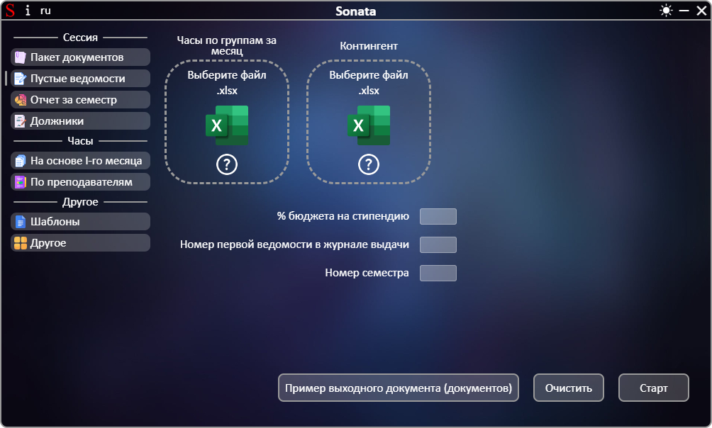
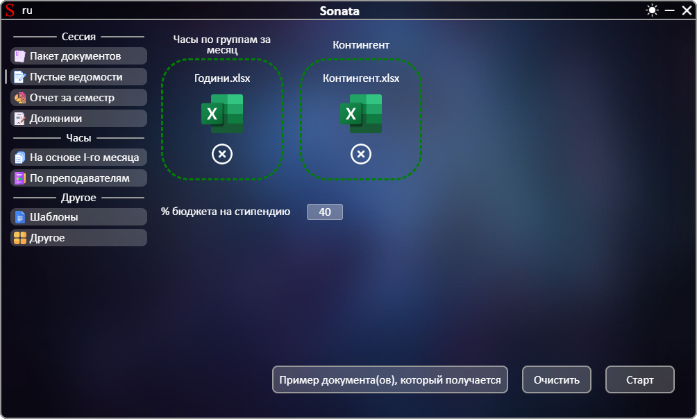

# **[←](README.md)**

# Пустые сведения

| EN [English](../en/empty_statements.md) | UK [Український](../empty_statements.md) | RU [Русский](empty_statements.md) |
|---|---|---|

Пустая страница:

## На странице нужно: 
 * Загрузить файлы путем перемещения файла в область элемента "Выберите файл" или нажатием на эту область; 
 * Проверить автоматически введенный % мест на стипендию в отношении бюджетных мест и при необходимости отредактировать данные путем нажатия на число.

Пример заполненной страницы:

# **[←](README.md)**