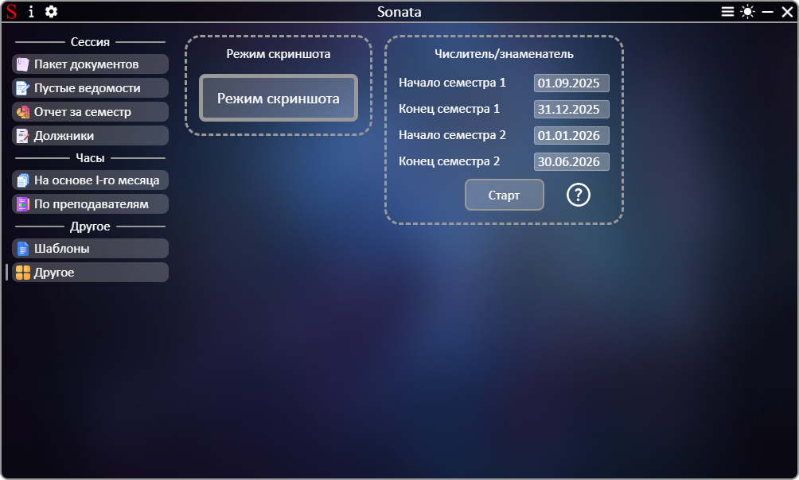

# **[←](README.md)**

# Создание отчета об успешности студентов всех групп за семестр

| EN [English](../en/other.md) | UK [Український](../other.md) | RU [Русский](other.md) |
|---|---|---|

## На странице можно: 
 * Включить режим скриншота. После включения режима все последующие копирования диапазона клеток в Microsoft Excel будут вызывать окно их сохранения в качестве изображения. В открывшемся окне можно указать коэффициент увеличения качества (в 2 раза, в 3 раза и т.д.) от 1 (без изменений) до 10 (повышение качества в 10 раз), по умолчанию стоит коэффициент 5; 
 * Сформировать документ графика недель числитель/знаменатель. Перед этим нужно проверить автоматически рассчитанные даты начала и конца семестров и при необходимости отредактировать их нажатием на дату.

Пример страницы:

# **[←](README.md)**