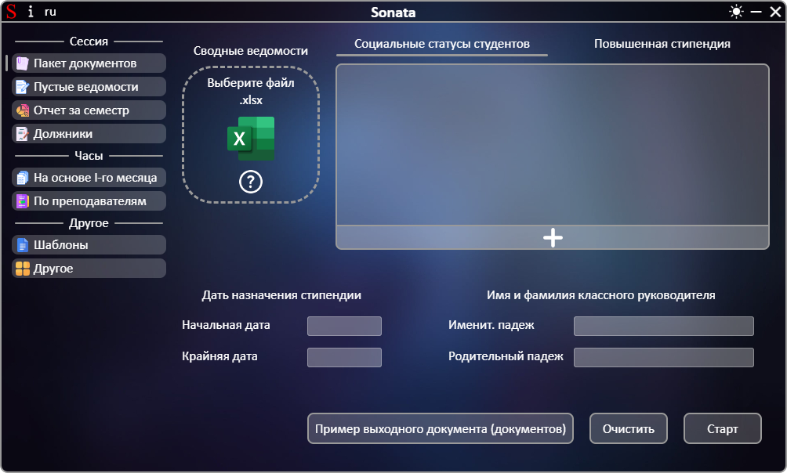
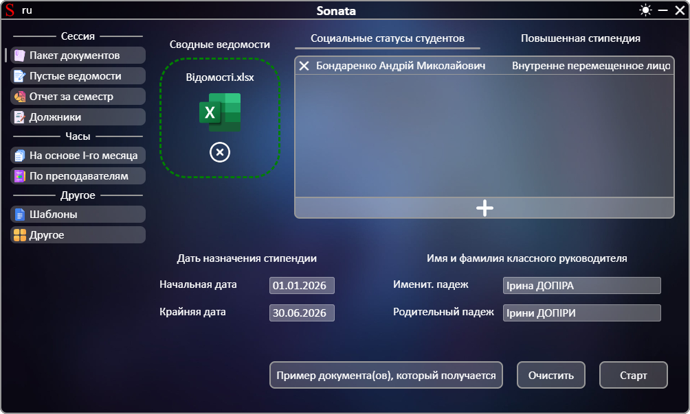

# **[←](README.md)**

# Создание полного пакета документов

| EN [English](../en/package_of_documents.md) | UK [Український](../package_of_documents.md) | RU [Русский](package_of_documents.md) |
|---|---|---|

Пустая страница:

## На странице нужно: 
 * Загрузить файл путем перемещения файла в область элемента "Выберите файл" или нажатием на эту область; 
 * Проверить автоматически рассчитанные даты начала и конца назначения стипендии. Редактировать данные в случае ошибки путем нажатия на текст и его изменение; 
 * Проверить полученные фамилию, имя классного руководителя и его авматически созданный падеж. Редактировать данные в случае ошибки путем нажатия на текст и его изменение; 
 * Заполнить список социальных статусов студентов и список студентов на повышенную стипендию: 
   - создание нового пункта списка происходит через нажатие на кнопку с "+"; 
   - для заполнения пункта нужно нажать на элементы пункта со словом "Выберите" и выбрать соответствующий параметр во всплывающем списке; 
   - пункты списка можно удалять через нажатие на кнопку "✕"; 
   - Вручную ввести социальный статус можно по нажатию кнопки с карандашом рядом с социальным статусом (карандаш отображается при наведении мыши на социальный статус).

Пример заполненной страницы:

# **[←](README.md)**