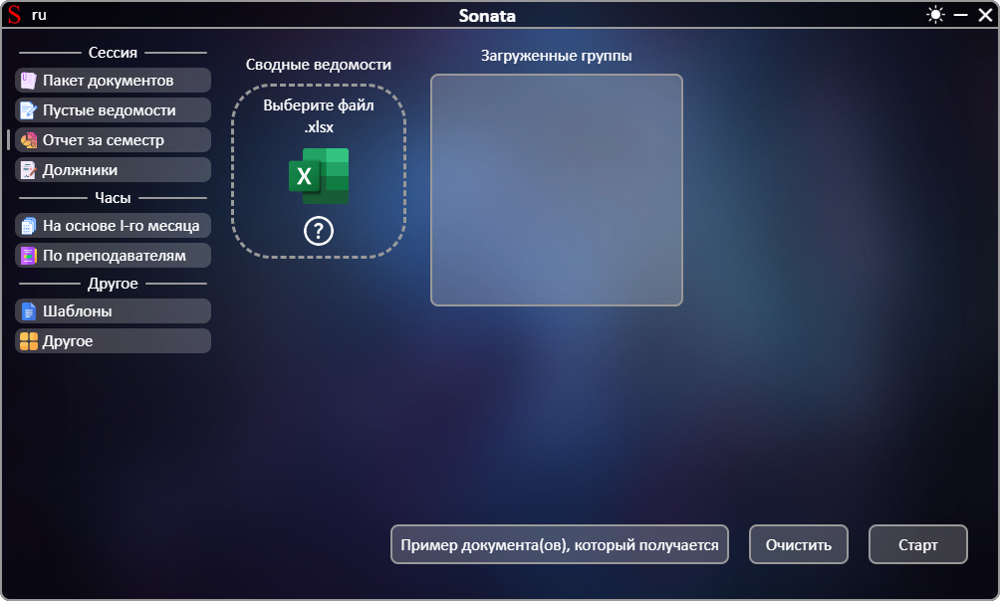
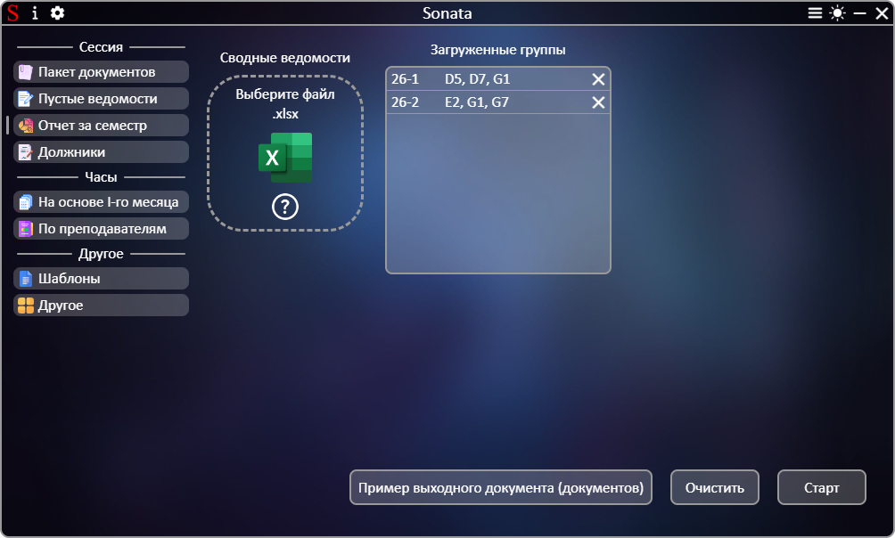

# **[←](README.md)**

# Создание отчета об успешности студентов всех групп за семестр

| EN [English](../en/report.md) | UK [Український](../report.md) | RU [Русский](report.md) |
|---|---|---|

Пустая страница:

## На странице нужно: 
 * Загрузить файлы путем перемещения файла в область элемента "Выберите файл" или нажатием на эту область; 
 * Проверить список полученных данных из файлов и при необходимости удалить элементы по нажатию на кнопку "✕".

Пример заполненной страницы:

# **[←](README.md)**