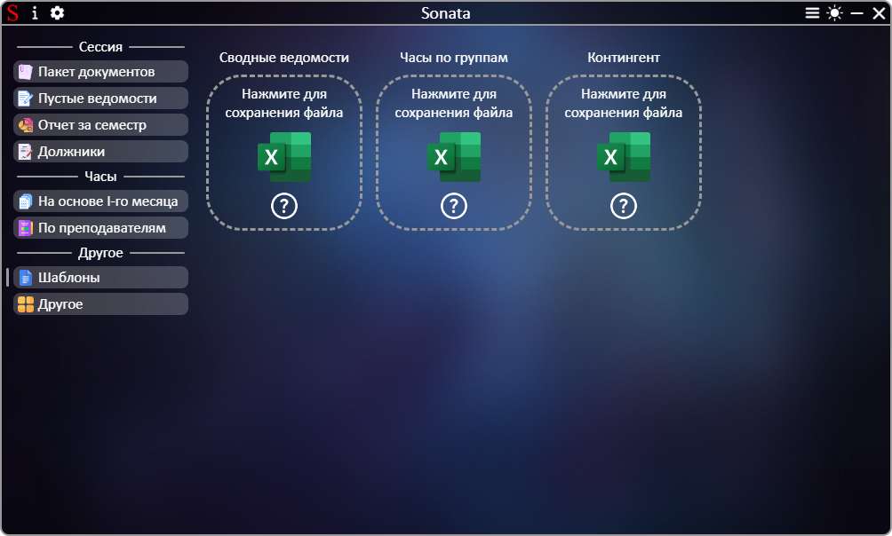

# **[←](README.md)**

# Создание отчета об успешности студентов всех групп за семестр

| EN [English](../en/templates.md) | UK [Український](../templates.md) | RU [Русский](templates.md) |
|---|---|---|

## На странице можно: 
 * Сохранить пустые файлы на устройство, которые в дальнейшем можно использовать в Sonata

Страница:

# **[←](README.md)**