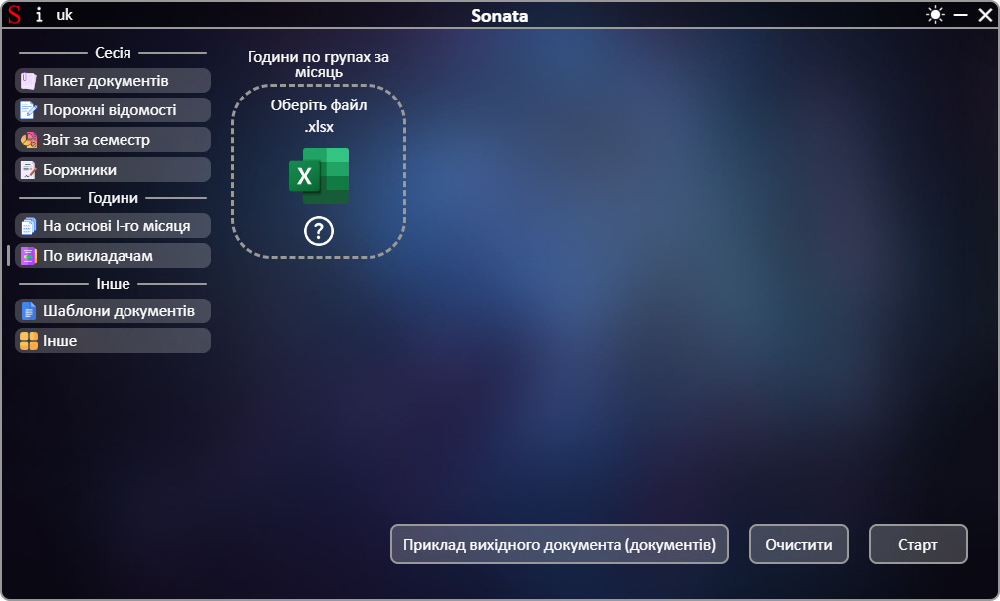
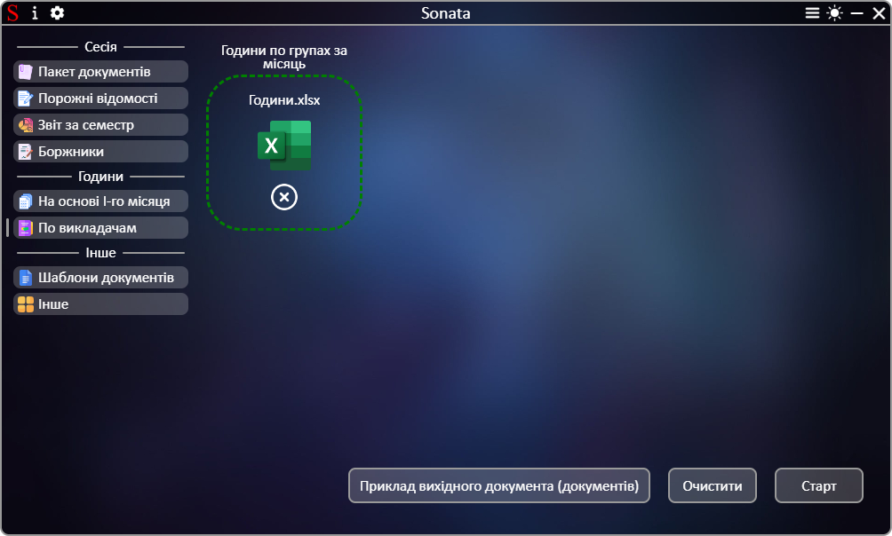

# **[←](README.md)**

# Створення звіту по годинам з усіх груп по викладачам

| EN [English](en/summary_of_teachers.md) | UK [Український](summary_of_teachers.md) | RU [Русский](ru/summary_of_teachers.md) |
|---|---|---|

Порожня сторінка:

## На сторінці потрібно:
 * Завантажити файли шляхом переміщення файлу до області елементу "Оберіть файл" чи натисканням на цю область.

Приклад заповненої сторінки:

# **[←](README.md)**