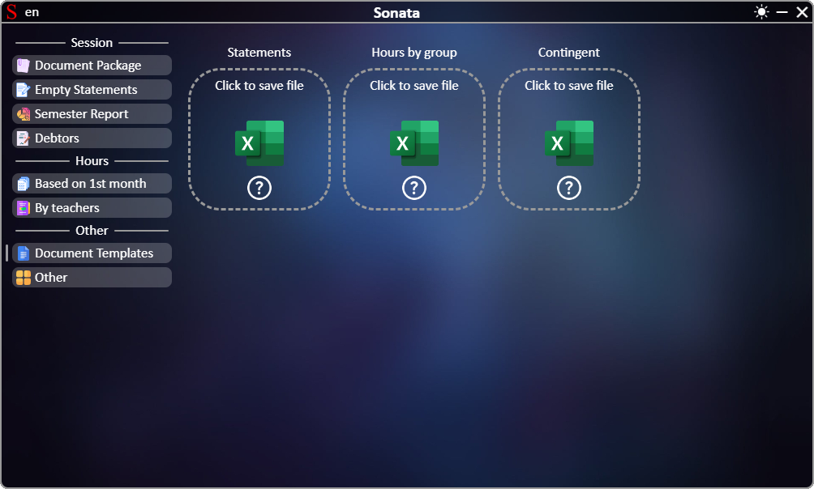

# **[←](README.md)**

# Завантаження порожніх документів

| EN [English](en/templates.md) | UK [Українська](templates.md) | RU [Русский](ru/templates.md) |
|---|---|---|

## На сторінці можно:
 * Зберегти порожні файли на пристрій, які в подальшому можно використовувати у програмі Sonata 

Сторінка:

# **[←](README.md)**